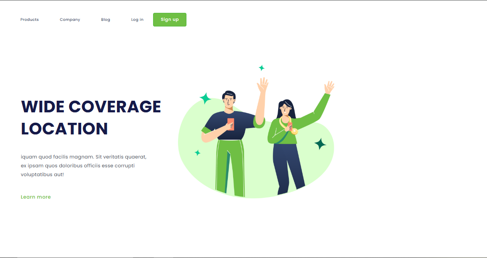
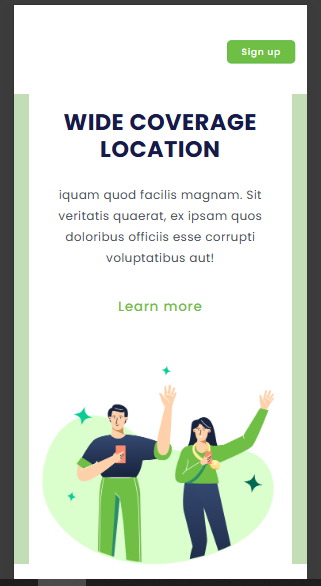

# 🌍 Wide Coverage

Interface responsiva desenvolvida como parte de um desafio de HTML e CSS. O projeto simula a landing page de um serviço com ampla cobertura geográfica.

## 🔗 Demonstração

 <!-- Substitua esse caminho pela imagem real, se quiser -->

## 🚀 Link do Projeto

[🔗 Clique aqui para ver o site publicado](https://ramonnmartins.github.io/wide-coverage/) 
<!-- Substitua com o link do GitHub Pages, Vercel ou Netlify -->

## 🛠 Tecnologias Utilizadas

- HTML5
- CSS3
- Responsividade com Media Queries

## 📱 Layout Responsivo

O site se adapta bem a diferentes tamanhos de tela, escondendo e ajustando elementos no mobile para manter uma experiência amigável.) <!-- Substitua esse caminho pela imagem real, se quiser -->

